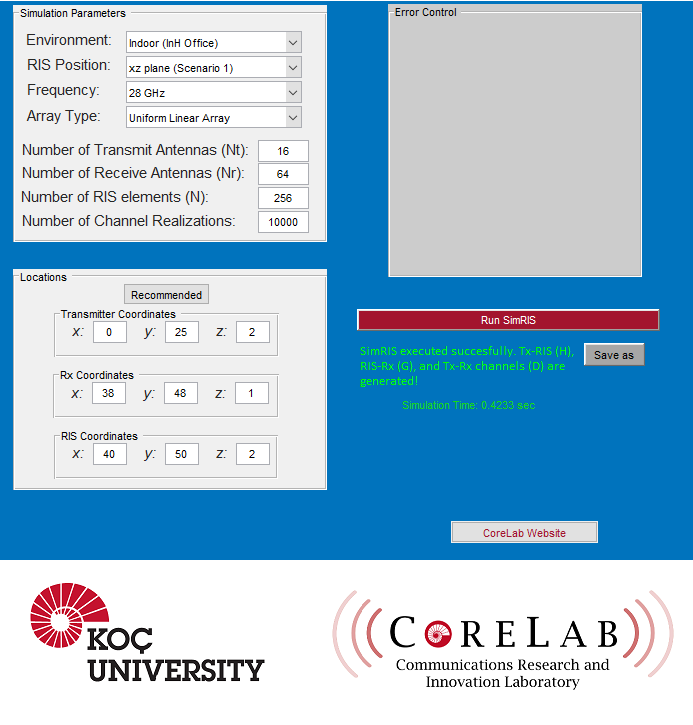

# SimRIS Channel Simulator v2.0

 <!-- Replace with your logo or a relevant image -->

Welcome to the _SimRIS Channel Simulator_ v2.0 repository! This open-source and user-friendly simulator is designed for accurate physical channel modeling of Reconfigurable Intelligent Surface (RIS)-empowered networks. Whether you're a researcher, developer, or enthusiast in the field of wireless communication, _SimRIS Channel Simulator_ v2.0 is here to support your studies and experiments.

## Key Features

- Comprehensive simulation of RIS-empowered networks' physical channel characteristics.
- Consideration of LOS probabilities, array responses, path loss, shadowing models, and environmental factors.
- Support for indoor and outdoor environments (Indoor Hotspot and Urban Microcellar) across popular mmWave frequencies (28 GHz and 73 GHz).
- MIMO terminal support with different array types (Uniform Linear Array and Uniform Planar Array).
- User-friendly Graphical User Interface (GUI) for scenario setup and customization.
- Generation of channel matrices (**H**, **G**, **D**) through Monte Carlo simulations for specified realizations.
- Open-source and written in MATLAB for easy accessibility and contribution.

## Getting Started

To quickly get started with _SimRIS Channel Simulator_ v2.0, follow these steps:

1. Clone or download this repository to your local machine.
2. Open the SimRIS_GUI.m and run it in MATLAB.
3. In the opened GUI, choose and select all parameters. Then, click the "Run SimRIS" button!
  (**Note:** SimRIS needs a parallel computing toolbox!)
4. If the simulation is not executed, please check the Error Control Box!
5. If the simulation is successfully executed, **H** (_N_x_Nt_x_Nsym_), **G** (_Nr_x_N_x_Nsym_), and **D** (_Nr_x_Nt_x_Nsym_) can be directly used from the MATLAB workspace.

   _N_: Number of Transmit Reflectors, _Nt_: Number of Transmit Antennas, _Nr_: Number of Receive Antennas, _Nsym_: Number of Channel Realizations
7. Using the "Save as" button, the channels can be downloaded in a ".mat" format.

## Documentation

For detailed instructions, usage examples, and further information about SimRIS Channel Simulator v2.0, please refer to our published studies: 

E. Basar, I. Yildirim, “[SimRIS Channel Simulator for Reconfigurable Intelligent Surface-Empowered Communication Systems](https://ieeexplore.ieee.org/abstract/document/9282349)“, in Proc. IEEE Latin-American Conf. Commun. (LATINCOM 2020), Nov. 2020. [PDF](https://corelab.ku.edu.tr/wp-content/uploads/2021/09/SimRIS_Channel_Simulator_for_Reconfigurable_Intelligent_Surface-Empowered_Communication_Systems.pdf)

E. Basar, I. Yildirim, F. Kilinc, “[Indoor and Outdoor Physical Channel Modeling and Efficient Positioning for Reconfigurable Intelligent Surfaces in mmWave Bands](https://ieeexplore.ieee.org/document/9541182)“, IEEE Trans. Commun. vol. 69, no. 12, pp. 8600-8611, Dec. 2021. [PDF](https://corelab.ku.edu.tr/wp-content/uploads/2021/09/TCOM_SimRIS.pdf)

E. Basar, I. Yildirim, “[Reconfigurable Intelligent Surfaces for Future Wireless Networks: A Channel Modeling Perspective](https://ieeexplore.ieee.org/abstract/document/9282349)“, IEEE Wireless Commun., vol. 28, no. 3, pp. 108–114, June 2021. [PDF](https://corelab.ku.edu.tr/wp-content/uploads/2021/09/Reconfigurable_Intelligent_Surfaces_for_Future_Wireless_Networks_A_Channel_Modeling_Perspective-1.pdf)

## License and Citation

_SimRIS Channel Simulator_ v2.0 is released under the GPLv2 license. If you in any way use this code for research that results in publications, please cite our original articles. 
The following Bibtex entry can be used:

                  @article{basar2020SimRIS,
                  Author = {E. {Basar} and I. {Yildirim}},
                  Booktitle = {Proc. IEEE Latin-American Conf. Commun. (LATINCOM 2020)},
                  Title= {{SimRIS} Channel Simulator for Reconfigurable Intelligent Surface-Empowered {mmWave} Communication Systems},
                  Year={2020},
                  month={Nov.},
                  Pages= {1-6},}
                  
                  @article{basar2020SimRIS_2,
                  Author = {E. {Basar} and I. {Yildirim} and F. {Kilinc}},
                  journal = {IEEE Trans. Commun. (Early access)}
                  Title = {Indoor and Outdoor Physical Channel Modeling and Efficient Positioning for Reconfigurable Intelligent Surfaces in mm{W}ave Bands},
                  Year = {2021},
                  month={Sep.},}
                  
                  @article{basar2021SimRIS_3,
                  Author = {E. {Basar} and I. {Yildirim}},
                  Journal= {IEEE Wireless Communications},
                  Title = {Reconfigurable Intelligent Surfaces for Future Wireless Networks: {A} Channel Modeling Perspective},
                  Year = {2021}, 
                  Volume={28},
                  Number={3},
                  Pages={108-114},
                  Doi= {10.1109/MWC.001.2000338},}
## Contributing

We welcome contributions from the community to enhance and improve _SimRIS Channel Simulator_ v2.0. Feel free to fork this repository, make improvements, and submit pull requests. For major changes, please open an issue to discuss the proposed changes.

## Contact

For inquiries, feedback, or collaboration opportunities, you can reach out to our team at [ibrahimyildirim19@ku.edu.tr](mailto:ibrahimyildirim19@ku.edu.tr) or [ebasar@ku.edu.tr](mailto:ebasar@ku.edu.tr).

Happy simulating!
